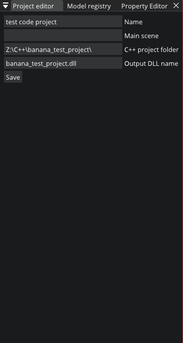

# The Banana
This is a 3D game engine I'm making. Many aspects of this engine are inspired by The Cherno's [Hazel](https://github.com/TheCherno/Hazel). It currently supports the following platforms:
- Windows

## TO IMPLEMENT
### ENTRYPOINT
If you want to implement WinMain/main on your own, **do not** define `BANANA_MAIN` before including `thebanana.h` in your `main.cpp`. It is required to set up the window (`WNDCLASS`, etc.) and initialize `thebanana::g_game` if you choose this option.

Otherwise, your `main.cpp` file should look something like this:
```cpp
// defining this tells thebanana.h to define WinMain/main
#define BANANA_MAIN
#include <thebanana.h>

// this class defines the games behavior and whatnot
class my_game_application_layer : public thebanana::application_layer {
public:
	// all of these are optional,
	// though if you dont define any of them
	// (or dont define this class at all and use the base class),
	// the "game" is just gonna be a tech demo
	virtual void register_scripts() override;
	virtual void init() override;
	virtual void gameloop() override;
	virtual void clean_up() override;
	virtual std::string window_title() override;
}

// this tells thebanana.h which application layer class to use
thebanana::application_layer* create_application_layer() {
	return new my_game_application_layer;
}

void my_game_application_layer::register_scripts() {
	// register scripts via thebanana::g_game->get_script_registry()
}
void my_game_application_layer::init() {
	// initialize your game (add gameobjects, load models, etc.)
}
void my_game_application_layer::gameloop() {
	// it's advised that you either dont define this or use the following lines of code:
	thebanana::g_game->update();
	thebanana::g_game->render();
	thebanana::g_game->swap_buffers();
}
void my_game_application_layer::clean_up() {
	// clean up your game (free resources and memory)
}
std::string my_game_application_layer::window_title() {
	// this method decides what title your game's window will have
	return "my game";
}
```

### EDITOR AND SCRIPT MODULES
To use the Banana Tree with your project, you must use script modules. "Script modules" are standard shared libraries with one thing in common; they must have an exported (`__declspec(dllexport)`), C-interface function named `load_scripts`. For example:
```cpp
#include <thebanana.h>
void load_scripts_cpp(void* r) {
	auto registry = (thebanana::script_registry*)r;
	// load scripts...
}
// set up the platform-specific symbol export...
#ifdef _WIN32
#define EXPORT __declspec(dllexport)
#else
#error no other platforms supported, unfortunately...
#else
extern "C" EXPORT void load_scripts(void* ptr) {
	load_scripts_cpp(ptr);
}
```

**Important:** you must add [these NuGet packages](readmefiles/packages.config) to compile and link your module correctly. There is no Premake script for modules yet, though there will be once I am done with all other necessary things.

Now, to use your script module, open your project in the Banana Tree and navigate to the project editor. Once that is done, open your Visual Studio solution (or input the solution directory) and specify the output file name of your code project. Afterwards, it should look something like this:



Then, click Save. This should build the project and attach it to the editor.

## TO BUILD
### PROJECT FILES
There is a Premake script included in the repository, with executables in the `vendor` folder. To generate projects, run the following commands:
- Windows: `vendor\premake5 vs2019`
- MacOS: `No implementation yet`
- Linux: `No implementation yet`